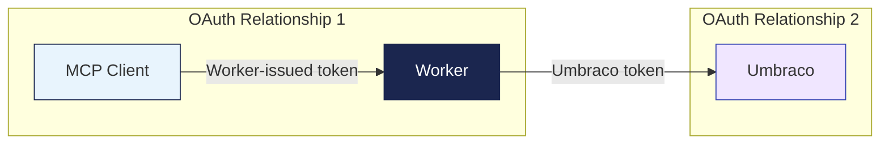
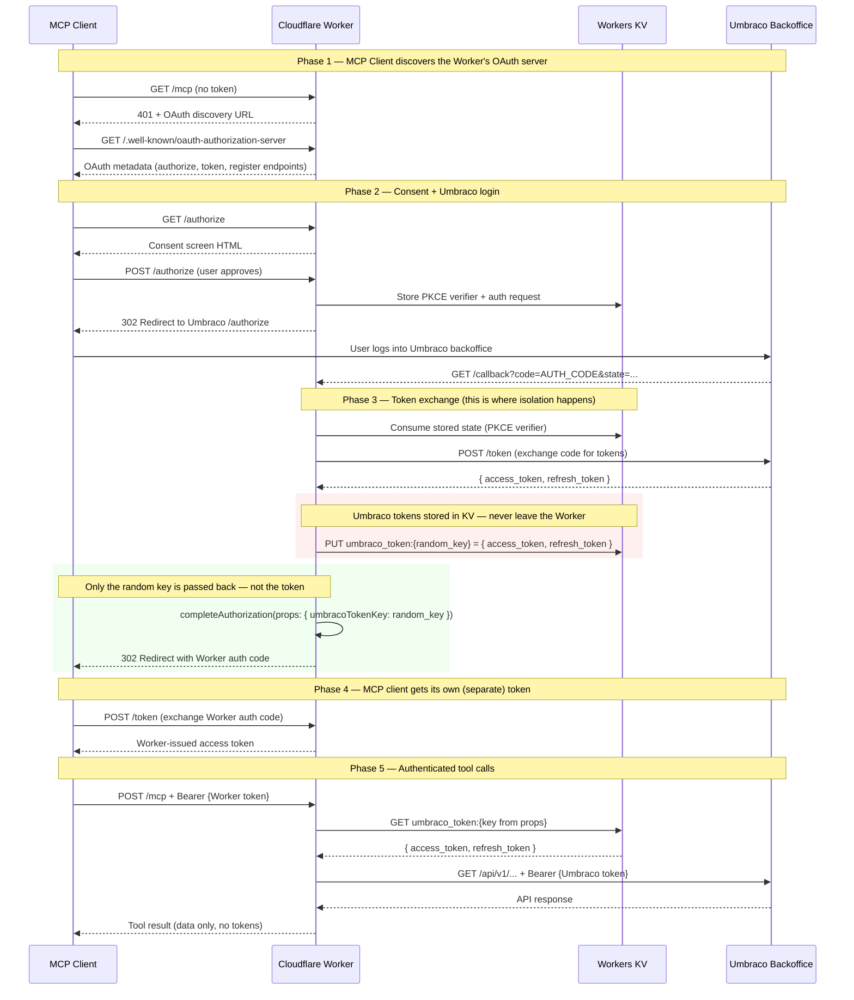
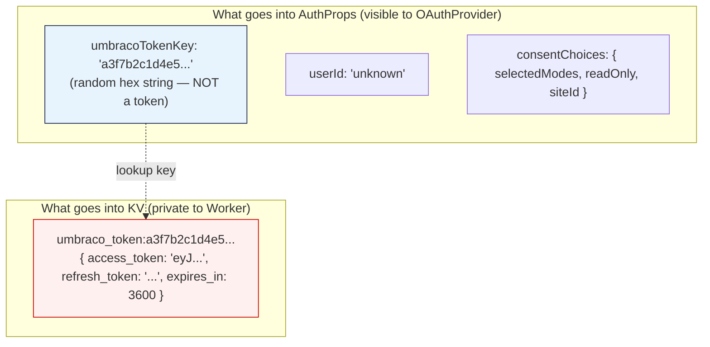
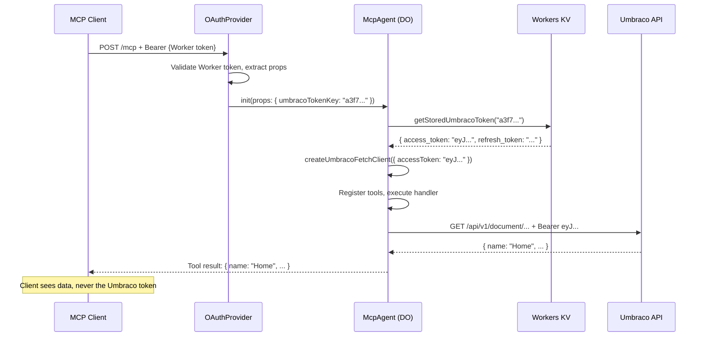

# Token Isolation: How Umbraco Tokens Stay Hidden from MCP Clients

The hosted MCP server uses a **dual-OAuth architecture** that ensures MCP clients never see or handle Umbraco access tokens. This is the core security property of the system and is mandated by the [MCP Authorization spec](https://modelcontextprotocol.io/specification/2025-03-26/basic/authorization).

## The Problem

An MCP client (like Claude Desktop or Cursor) needs to call Umbraco Management API endpoints on behalf of a backoffice user. The naive approach would be to pass the Umbraco token directly to the MCP client — but this is dangerous:

- The MCP client could leak the token (logs, telemetry, shared state)
- The token could be reused for API calls outside the MCP server's scope
- A compromised client would have direct Umbraco API access
- The MCP server would have no way to revoke or restrict access

## The Solution: Two Separate OAuth Relationships

The Worker maintains two independent OAuth flows. The MCP client only ever sees tokens from one of them — the Worker's own tokens. The Umbraco tokens exist only inside the Worker and its KV storage.

The Worker is simultaneously:
- An **OAuth Authorization Server** to the MCP client (issues its own tokens)
- An **OAuth Client** to Umbraco (holds Umbraco tokens privately)

## Full Authorization Flow

This sequence shows every step from the MCP client's initial connection through to authenticated tool calls. The critical moment is steps 12–14, where the Umbraco token is stored in KV and only a random reference key is passed back.

## What Each Party Sees

| Party | What it holds | What it never sees |
|-------|--------------|-------------------|
| **MCP Client** | Worker-issued access token | Umbraco access token, refresh token, KV reference key |
| **Worker** | Both tokens (briefly during exchange); KV reference key in props | — |
| **Workers KV** | Umbraco access token + refresh token (keyed by random hex) | Worker-issued tokens |
| **Umbraco** | Its own tokens | Worker-issued tokens, KV reference key |

## The Key Mechanism: Indirection Through KV

The critical design choice is what gets stored in `AuthProps` — the per-user data that the `OAuthProvider` associates with the MCP client's session.

The `umbracoTokenKey` in props is just an opaque random string (64 hex characters from `crypto.getRandomValues`). It has no cryptographic relationship to the Umbraco token — it's purely a lookup key for KV.

## Per-Request Token Retrieval

On every MCP tool call, the Worker reconstructs an authenticated API client from the KV reference:

If the token has expired, the fetch client handles refresh transparently:

1. API call returns 401
2. Fetch client calls `refreshUmbracoToken()` with the stored refresh token
3. New tokens are written back to the same KV key
4. The original request is retried with the new access token
5. If refresh fails, the error propagates and the user must re-authenticate

## Token Lifetimes

```mermaid
gantt
    title Token Lifetime Comparison
    dateFormat X
    axisFormat %s

    section Worker Token
    Worker access token (managed by OAuthProvider)    :active, 0, 3600

    section Umbraco Tokens in KV
    Umbraco access token (typically 1 hour)           :crit, 0, 3600
    KV TTL buffer (+5 min for refresh)                :done, 3600, 3900
    Refresh token (long-lived, days/weeks)            :active, 0, 86400
```

The KV entry's TTL is set to `expires_in + 300` seconds. The 5-minute buffer ensures the refresh token is still available in KV when the access token expires, giving the fetch client time to refresh before the KV entry is garbage-collected.

## Why This Architecture Matters

### Revocation

The Worker can revoke access by deleting the KV entry. The MCP client's Worker token becomes useless — it resolves to nothing in KV. No need to coordinate with Umbraco's token revocation.

### Scope restriction

The Worker controls which API calls are made. Even if the Umbraco token has broad scopes, the Worker only exposes specific tool handlers. User consent choices further narrow which tools are available.

### Blast radius

If an MCP client is compromised, the attacker gets a Worker token — not an Umbraco token. The Worker token only works with the Worker's MCP endpoint and is useless against Umbraco directly.

### Auditability

All Umbraco API calls originate from the Worker. The Worker can log, rate-limit, and monitor every request without relying on the MCP client to be honest about its token usage.

## Related Documentation

- [Architecture](./architecture.md) — Full auth flow diagram and component architecture
- [Security Model](./security.md) — MCP spec compliance, CSRF protection, SSRF mitigations
- [Auth Internals](./auth-internals.md) — KV state schema, token lifecycle, backoffice endpoint resolution
